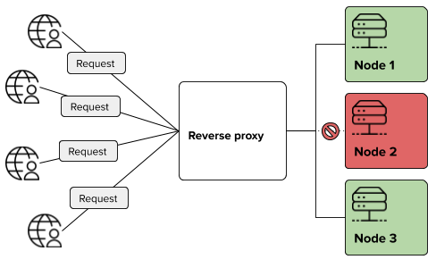
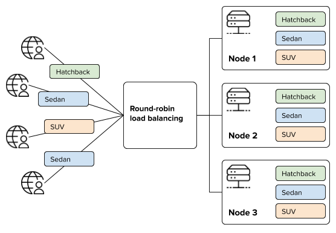
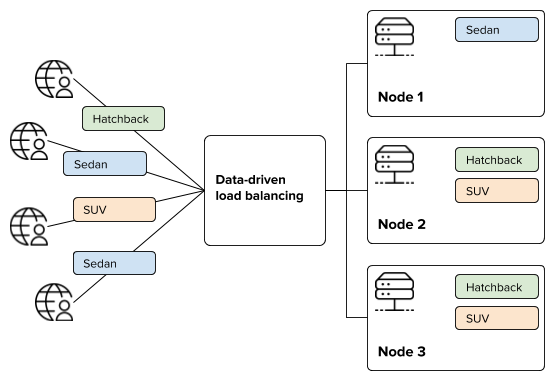

# CLM Platform hosting samples

The samples in this repository focus on scaling CLM Platform to provide failover and improve performance.

All samples use the [Traefik](https://traefik.io) reverse proxy for handling routing and load balancing of the individual nodes. Traefik is our choice for the samples, but the principles should apply to most reverse proxies and load balancers.
We have chosen Traefik because:

- The project is under active development.
- Traefik is distributed as a standalone executable - no installation required.
- All settings can be specified in a self-contained configuration file.

In the samples, the CLM Platform APIs are run in standalone mode using the built-in Kestrel web server.

Although scaling in real life requires multiple logical servers, the samples will by default launch the individual nodes on your pc.
You can easily adapt the Traefik configuration to a distributed scenario by adjusting IP addresses etc.

We cover the following scenarios:

1. [Reverse proxy](#scenario-1-reverse-proxy): Host the CLM Platform APIs and application behind a single entry point.
1. [Redundancy and failover](#scenario-2-redundancy-and-failover): Scale CLM Platform to provide failover for the Configuration API.
1. [Round-robin load balancing](#scenario-3-round-robin-load-balancing): Scale CLM Platform to provide load balancing for the Configuration API.
1. [Data driven load balancing](#scenario-4-data-driven-load-balancing): Scale CLM Platform to provide load balancing for the Configuration API using a data driven strategy.

## Running the samples

Start by cloning this repository to your local disk and then follow the guide that matches your OS.

### Windows

- Obtain the CLM Platform distribution and follow the installation instructions.
- Download Traefik 2.0.\* from [here](https://github.com/containous/traefik/releases) and place it in a suitable location.
- Open `run.bat` in a text editor:
  - Edit the `INSTALL_DIR` variable to match your CLM Platform installation directory.
  - Edit the `TRAEFIK_EXE` variable to where you placed the downloaded Traefik binary.
  - Edit the `TRAEFIK_CONFIG` variable to match the scenario that you want to run.
  - Optionally edit the `TRAEFIK_PORT` - the default port 80 might already be in use.
- Execute `run.bat` from a CMD command prompt.

The `run.bat` script will launch terminal windows for each server node and a window for Traefik. It will also open up a browser tabs for the Traefik UI dashboard and a tab pointing to the CLM Platform configurator.

Note that the script overrides all application settings related to storage, logging and endpoints. If you have already changed the CLM Platform settings, you might run into conflicts when running the samples.

### Linux and Unix systems

- Obtain the CLM Platform distribution and unzip it to a suitable location.
- Download Traefik 2.0.\* from [here](https://github.com/containous/traefik/releases) and place it in a suitable location.
- Open `run.sh` in a text editor:
  - Edit the `INSTALL_DIR` variable to match your CLM Platform installation directory.
  - Edit the `TRAEFIK_EXE` variable to where you placed the downloaded Traefik binary.
  - Edit the `TRAEFIK_CONFIG` variable to match the scenario that you want to run.
  - Optionally edit the `TRAEFIK_PORT` - the default port 80 might already be in use.
- Execute `run.sh` Bash script from a terminal.

The `run.sh` script will launch the server nodes and Traefik as background processes. When you press Ctrl+C, the processes will be killed.

Note that the script overrides all application settings related to storage, logging and endpoints.

Using a web browser, go to `http://localhost:<TRAEFIK_PORT>` to open the configurator web app. To view the Traefik dashboard, go to `http://localhost:8080`.

### Data and configuration

When you have successfully launched a sample, you can then adjust settings such as logging and the storage connection string by editing the `appsettings.json` file or directly in the `run.bat`/`run.sh` script. Note that modifying the `appsettings.json` file requires a restart of the services before it will take effect.

To test a sample, you can publish a package using the `clm` tool - for example the iHear sample package provided in the CLM Platform distribution. The CLM Platform configurator web app allows you to browse VT packages and test product configurations.

## Scenario 1: Reverse proxy

A reverse proxy enables you to provide a single entry point for multiple services and applications. In the figure below the reverse proxy acts as a gateway to the Configuration API, Storage API, the CLM Platform documentation site and configurator application.


All requests from the outside go through the reverse proxy. The reverse proxy inspects the URL and routes the request accordingly.

In a Traefik configuration, the `routers` define how HTTP requests are routed to
individual `services`:

```yaml
http:
  routers:
    # Everything prefixed with "/storage/v1" goes to the Storage API
    storage:
      rule: "PathPrefix(`/storage/v1`)"
      service: storage

    # Everything prefixed with "/configurator/v1" goes to the Configuration API
    configuration:
      rule: "PathPrefix(`/configurator/v1`)"
      service: configuration

    # Everything not matching the rules for the Storage and Configuration APIs goes here.
    ui:
      rule: "PathPrefix(`/`)"
      service: ui

  services:
    # The "storage" service covers the single Storage API node.
    storage:
      loadBalancer:
        servers:
          - url: http://localhost:9021

    # The "configurator" service corresponds to a single Configuration API node.
    configuration:
      loadBalancer:
        servers:
          - url: http://localhost:9011

    # The "ui" service for the configurator web app and documentation.
    ui:
      loadBalancer:
        servers:
          - url: http://localhost:9001
```

See [1_reverse_proxy.yaml](scenarios/1_reverse_proxy.yaml) for the full configuration.

## Scenario 2: Redundancy and failover

The reverse proxy example above does not add any redundancy to your setup. The figure below shows how a redundant setup could look like.



For CLM Platform, you would probably like to provide one or more redundant Configuration API instances.
To enable redundancy, you need to change the `services` section of the Traefik configuration:

```yaml
services:
  # The "storage" service covers the single Storage API node.
  storage:
    loadBalancer:
      # A health check is added, allowing Traefik to detect if a server is down.
      healthCheck:
        path: /health
        interval: "30s"
        timeout: "3s"
      servers:
        - url: http://localhost:9021

  # The "configuration" service corresponds to a single Configuration API node.
  configuration:
    loadBalancer:
      # A health check is added, allowing Traefik to detect if a server is down.
      healthCheck:
        path: /health
        interval: "30s"
        timeout: "3s"
      servers:
        - url: http://localhost:9011
        - url: http://localhost:9012
        - url: http://localhost:9013

  # The "ui" service for the configurator web app and documentation.
  ui:
    loadBalancer:
      # A health check is added, allowing Traefik to detect if a server is down.
      healthCheck:
        path: /health
        interval: "30s"
        timeout: "3s"
      servers:
        - url: http://localhost:9001
```

This change adds the following:

- The Configuration API is scaled to three nodes, providing failover.
- Traefik queries the `/health` endpoint every 30 seconds, removing nodes that are down. When a node is up again, Traefik will discover it and start directing requests to the node again.

See [2_redundancy.yaml](scenarios/2_redundancy.yaml) for the full configuration.

## Scenario 3: Round-robin load balancing

The figure below shows an example where four uses configure three different cars. When using a _round-robin_ load balancing strategy, all nodes will eventually configure all three car models.



In the redundancy example above, we scaled the Configuration API to three nodes.
We did not configure any load balancing settings and, in practice, this means that Traefik will use a round-robin strategy, distributing requests evenly on the three nodes.

We can modify the `configuraton` section:

```yaml
# The "configuration" service is a weighted round-robin load balancer based on three nodes.
# The nodes are divided into two groups with weights of 4 and 1 respectively.
configuration:
  weighted:
    services:
      - name: configuration-powerful
        weight: 4
      - name: configuration-backup
        weight: 1
configuration-powerful:
  loadBalancer:
    healthCheck:
      path: /health
      interval: "30s"
      timeout: "3s"
    servers:
      - url: http://localhost:9011
      - url: http://localhost:9012
configuration-backup:
  loadBalancer:
    healthCheck:
      path: /health
      interval: "30s"
      timeout: "3s"
    servers:
      - url: http://localhost:9013
```

This change adds the following:

- We use a weighted load balancing strategy and divide the nodes into two services.
- We assign a `weight` to the services. The weight describes how well the services are expected to perform relative to other services.
  For example, a service with the weight 2 should be twice as fast as a service with a weight of 1.

See [3_lb_round_robin.yaml](scenarios/3_lb_round_robin.yaml) for the full configuration.

## Scenario 4: Data driven load balancing

In the round-robin load balancing example above, all nodes will eventually take part in configuring all products.
If some products require a particularly powerful server or all product models in use won't fit into the RAM of the nodes,
then you can try to apply _data driven load balancing_. Instead distributing requests evenly across the nodes, you can appoint
specific nodes to handled specific data. In the figure below, Node 1 handles all requests to the Sedan car model.



In this example we will use the package path as driver for selecting a node to handle the request.
Alternatively you could use a special HTTP header carrying information for the load balancer to pick up.

First we add a separate service for the powerful server:

```yaml
services:
  # The "configuration-powerful" service corresponds to a single Configuration API node.
  configuration-powerful:
    loadBalancer:
      # A health check is added, allowing Traefik to detect if a server is down.
      healthCheck:
        path: /health
        interval: "30s"
        timeout: "3s"
      servers:
        - url: http://localhost:9011

  # The "configuration-default" service corresponds to two Configuration API nodes.
  configuration-default:
    loadBalancer:
      # A health check is added, allowing Traefik to detect if a server is down.
      healthCheck:
        path: /health
        interval: "30s"
        timeout: "3s"
      servers:
        - url: http://localhost:9012
        - url: http://localhost:9013
```

With this change the Configuration API is split into two services - one for the complex models and one service to handle the rest.

Assuming your complex model is located in a VT package called `ihear_complex`, you can adjust the `routers` section:

```yaml
routers:
  # Everything prefixed with "/configurator/v1" and in the ihear VT package goes to the powerful node
  configuration-ihear-complex:
    rule: "PathPrefix(`/configurator/v1`) && Query(`packagePath={id:samples\\/ihear_complex(.)*}`)"
    service: configuration-powerful

  # Everything prefixed with "/configurator/v1" and NOT in the ihear_complex VT package goes to the default node
  configuration-default:
    rule: "PathPrefix(`/configurator/v1`)"
    service: configuration-default
```

This will make the queries for the Configuration API go to the `configuration-powerful` service when the package path starts with
`samples/ihear_complex`. The rest of the queries will go to the two `configuration-default` nodes.

See [4_lb_data_driven.yaml](scenarios/4_lb_data_driven.yaml) for the full configuration.
