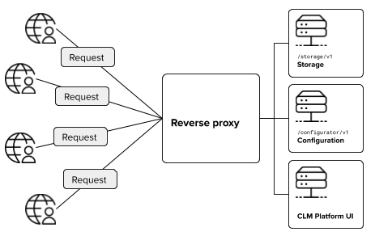

# CLM Platform hosting samples

The samples in this repository focus on scaling CLM Platform to provide failover and improve performance.

All samples use the [Traefik](https://traefik.io) reverse proxy for handling routing and load balancing of the individual nodes. Traefik is our choice for the samples, but the principles should apply to most reverse proxies and load balancers.
We have chosen Traefik because:

- The project is under active development.
- Traefik is distributed as a standalone executable - no installation required.
- All settings can be specified in a self-contained configuration file.

In the samples, the CLM Platform APIs are run in standalone mode using the built-in Kestrel web server.

Although scaling in real life requires multiple logical servers, the samples will by default launch the individual nodes on your pc.
You can easily adapt the Traefik configuration to a distributed scenario by adjusting IP addresses etc.

We cover the following scenarios:

1. [Reverse proxy](#scenario-1-reverse-proxy): Host the CLM Platform APIs and application behind a single entry point.
1. [Redundancy and failover](#scenario-2-redundancy-and-failover): Scale CLM Platform to provide failover for the Configuration API.
1. [Round-robin load balancing](#scenario-3-round-robin-load-balancing): Scale CLM Platform to provide load balancing for the Configuration API.
1. [Data driven load balancing](#scenario-4-data-driven-load-balancing): Scale CLM Platform to provide load balancing for the Configuration API using a data driven strategy.

## Running the samples

Start by cloning this repository to your local disk and then follow the guide that matches your OS.

### Windows

- Obtain the CLM Platform distribution and follow the installation instructions.
- Download Traefik 1.7.\* from [here](https://github.com/containous/traefik/releases) and place it in a suitable location.
- Open `run.bat` in a text editor:
  - Edit the `INSTALL_DIR` variable to match your CLM Platform installation directory.
  - Edit the `TRAEFIK_EXE` variable to where you placed the downloaded Traefik binary.
  - Edit the `TRAEFIK_CONFIG` variable to match the scenario that you want to run.
  - Optionally edit the `TRAEFIK_PORT` - the default port 80 might already be in use.
- Execute `run.bat` from a CMD command prompt.

The `run.bat` script will launch terminal windows for each server node and a window for Traefik. It will also open up a browser tabs for the Traefik UI dashboard and a tab pointing to the CLM Platform configurator.

Note that the script overrides all application settings related to storage, logging and endpoints. If you have already changed the CLM Platform settings, you might run into conflicts when running the samples.

### Linux and Unix systems

- Obtain the CLM Platform distribution and unzip it to a suitable location.
- Download Traefik 1.7.\* from [here](https://github.com/containous/traefik/releases) and place it in a suitable location.
- Open `run.sh` in a text editor:
  - Edit the `INSTALL_DIR` variable to match your CLM Platform installation directory.
  - Edit the `TRAEFIK_EXE` variable to where you placed the downloaded Traefik binary.
  - Edit the `TRAEFIK_CONFIG` variable to match the scenario that you want to run.
  - Optionally edit the `TRAEFIK_PORT` - the default port 80 might already be in use.
- Execute `run.sh` Bash script from a terminal.

The `run.sh` script will launch the server nodes and Traefik as background processes. When you press Ctrl+C, the processes will be killed.

Note that the script overrides all application settings related to storage, logging and endpoints.

Using a web browser, go to `http://localhost:<TRAEFIK_PORT>` to open the configurator web app. To view the Traefik dashboard, go to `http://localhost:8080`.

### Data and configuration

When you have successfully launched a sample, you can then adjust settings such as logging and the storage connection string by editing the `appsettings.json` file. Note that modifying the `appsettings.json` file requires a restart of the services before it will take effect.

To test a sample, you can publish a package using the `clm` tool - for example the iHear sample package provided in the CLM Platform distribution. The CLM Platform configurator web app allows you to browse VT packages and test product configurations.

## Scenario 1: Reverse proxy

A reverse proxy enables you to provide a single entry point for multiple services and applications. In the figure below the reverse proxy acts as a gateway to the Configuration API, Storage API, the CLM Platform documentation site and configurator application.



All requests from the outside go through the reverse proxy. The reverse proxy inspects the URL and routes the request accordingly.

The `[backends]` define the individual nodes that host the CLM Platform services:

```toml
[backends]
  # The "configurator" backend corresponds to a single Configuration API node.
  [backends.configurator]
    [backends.configurator.servers.server1]
    url = "http://127.0.0.1:9011"

  # The "storage" backend covers the single Storage API node.
  [backends.storage]
    [backends.storage.servers.server1]
    url = "http://127.0.0.1:9021"

  # The "ui" backend for the configurator web app and documentation.
  [backends.ui]
    [backends.ui.servers.server1]
    url = "http://127.0.0.1:9001"
```

The configuration below shows how you can configure Traefik to route requests based on the path in the `[frontends]` section.

```toml
[frontends]
  [frontends.storage]
  backend = "storage"
    [frontends.storage.routes.default]
    # Everything prefixed with "/storage/v1" goes to the Storage API
    rule = "PathPrefix:/storage/v1"

  [frontends.configurator]
  backend = "configurator"
    [frontends.configurator.routes.default]
    # Everything prefixed with "/configurator/v1" goes to the Configuration API
    rule = "PathPrefix:/configurator/v1"

  # Everything not matching the rules for the Storage and Configuration APIs goes here.
  [frontends.ui]
  backend = "ui"
```

See [1_reverse_proxy.toml](scenarios/1_reverse_proxy.toml) for the full configuration.

## Scenario 2: Redundancy and failover

The reverse proxy example above does not add any redundancy to your setup. The figure below shows how a redundant setup could look like.


For CLM Platform, you would probably like to provide one or more redundant Configuration API instances.
To enable redundancy, you need to change the `[backends]` section of the Traefik configuration:

```toml
[backends]
  # The "configurator" backend corresponds to two Configuration API node.
  [backends.configurator]
    [backends.configurator.servers.server1]
    url = "http://127.0.0.1:9011"
    [backends.configurator.servers.server2]
    url = "http://127.0.0.1:9012"
    [backends.configurator.servers.server3]
    url = "http://127.0.0.1:9013"
    # A health check is added, allowing Traefik to detect if a service is down.
    [backends.configurator.healthcheck]
    path = "/health"
    interval = "60s"

  # The "storage" backend covers the single Storage API node.
  [backends.storage]
    [backends.storage.servers.server1]
    url = "http://127.0.0.1:9021"
    # A health check is added, allowing Traefik to detect if a service is down.
    [backends.storage.healthcheck]
    path = "/health"
    interval = "60s"

  # The "ui" backend for the configurator web app and documentation.
  [backends.ui]
    [backends.ui.servers.server1]
    url = "http://127.0.0.1:9001"
    [backends.ui.healthcheck]
    path = "/health"
    interval = "60s"
```

This change adds the following:

- The Configuration API is scaled to three nodes, providing failover.
- Traefik queries the `/health` endpoint every 60 seconds, removing nodes that are down. When node is up again, Traefik will discover it and start directing requests to the node again.

See [2_redundancy.toml](scenarios/2_redundancy.toml) for the full configuration.

## Scenario 3: Round-robin load balancing

The figure below shows an example where four uses configure three different cars. When using a _round-robin_ load balancing strategy, all nodes will eventually configure all three car models.


In the redundancy example above, we scaled the Configuration API to three nodes.
We did not configure any load balancing settings and in practice, this means that Traefik will use a round-robin strategy, distributing requests evenly on the three nodes.

We can modify the `[backends.configurator]` sections slightly:

```toml
[backends]
  # The "configurator" backend corresponds to two Configuration API node.
  [backends.configurator]
    [backends.configurator.loadbalancer]
    # Use a weighted round-robin. Each server's assigned "weight" gives an indication
    # of how well that server performs relative to the other servers - higher is better.
    method = "wrr"
    [backends.configurator.servers.server1]
    url = "http://127.0.0.1:9011"
    weight = 4
    [backends.configurator.servers.server2]
    url = "http://127.0.0.1:9012"
    weight = 2
    [backends.configurator.servers.server3]
    url = "http://127.0.0.1:9013"
    weight = 1
```

This change adds the following:

- We explicitly state the load-balancing strategy `wrr`, which stands for _weighted round-robin_.
- We assign a `weight` to all nodes, used by the `wrr` strategy. The weight describes how well the node is expected to perform relative to the other nodes. For example, a node with the weight 2 should be twice as fast as a node with a weight of 1.

See [3_lb_round_robin.toml](scenarios/3_lb_round_robin.toml) for the full configuration.

## Scenario 4: Data driven load balancing

In the round-robin load balancing example above, all nodes will eventually take part in configuring all products.
If some products require a particularly powerful server or all product models in use won't fit into the RAM of the nodes,
then you can try to apply _data driven load balancing_. Instead distributing requests evenly across the nodes, you can appoint
specific nodes to handled specific data. In the figure below, Node 1 handles all requests to the Sedan car model.


In this example we will use the package path as driver for selecting a node to handle the request.
Alternatively you could use a special HTTP header carrying information for the load balancer to pick up.

Assuming your complex model is locate in a package called `ihear_complex`, you can adjust the `[backends]` section like this:

```toml
[backends]
  # The "configurator_ihear_complex" backend corresponds to a single Configuration API node.
  [backends.configurator_ihear_complex]
    [backends.configurator_ihear_complex.loadbalancer]
    method = "wrr"
    [backends.configurator_ihear_complex.servers.server1]
    url = "http://127.0.0.1:9011"
    weight = 1

  # The "configurator_default" backend corresponds to two Configuration API nodes.
  [backends.configurator_default]
    [backends.configurator_default.loadbalancer]
    method = "wrr"
    [backends.configurator_default.servers.server2]
    url = "http://127.0.0.1:9012"
    weight = 1
    [backends.configurator_default.servers.server3]
    url = "http://127.0.0.1:9013"
    weight = 1
```

With this change the Configuration API is split into two backends - one for the complex model and one for all other models.

Next, adjust the `[frontends]` section:

```toml
[frontends]
  [frontends.configurator_ihear_complex]
  backend = "configurator_ihear_complex"
    [frontends.configurator_ihear_complex.routes.prefix]
    rule = "PathPrefix:/configurator/v1"
    [frontends.configurator_ihear_complex.routes.query]
    rule = "Query:packagePath={id:samples\\/ihear_complex(.)*}"

  [frontends.configurator_default]
  backend = "configurator_default"
    [frontends.configurator_default.routes.default]
    # Everything prefixed with "/configurator/v1" goes to the default node.
    rule = "PathPrefix:/configurator/v1"

```

This will make the queries for the Configuration API go to the `configurator_ihear_complex` backend when the package path starts with
`samples/ihear_complex`. The rest of the queries will go to the two `configurator_default` nodes.

See [4_lb_data_driven.toml](scenarios/4_lb_data_driven.toml) for the full configuration.
